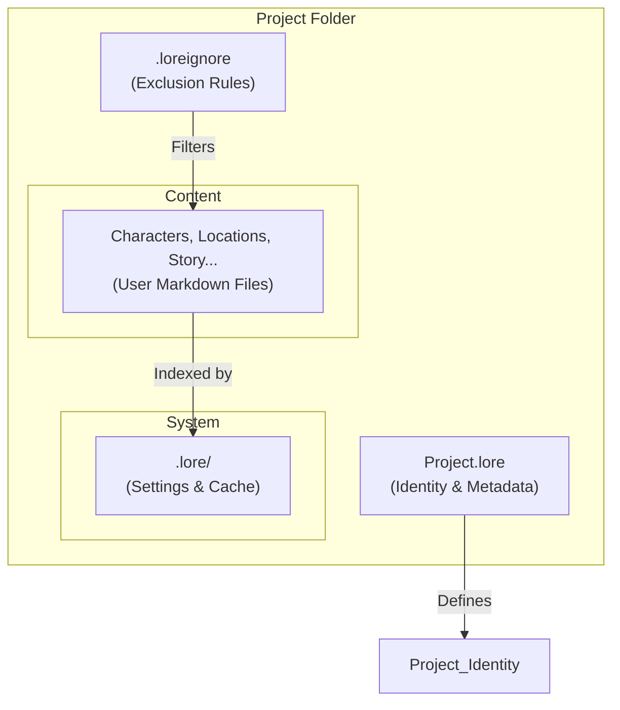

# Lore Designer


<div align="center">
  
  
  <h3>Design Narratives, Build Legends</h3>
  
  <p>
    <strong>A personal knowledge management tool designed specifically for worldbuilding and creative writing.</strong>
  </p>
</div>

## Early Development

**Warning:** Lore Designer is currently in a **Pre-Alpha** phase. The application is not ready for production use and may contain bugs. Always back up your data.

## What is Lore Designer?

Lore Designer is an **Offline-First** desktop application that helps writers and game developers organize their stories. It bridges the gap between generic note-taking apps (Obsidian, Notion) and rigid writing software (Scrivener).

### Core Philosophy

- **User Owns Their Data:** Everything is stored as plain text files (`.md`, `.toml`, `.json`) on your local drive. No hidden databases.
- **No Lock-in:** You can open your project folder with any text editor (VS Code, Notepad, Vim) and it will remain perfectly readable.
- **Performance:** Built to handle thousands of files without lag.


## How a Workspace Works

Lore Designer projects are just standard folders on your computer. However, the application uses three special components to manage your project logic without polluting your content.



1.  **The Manifest (`.lore`):**

    - It is a simple TOML file that gives your project an identity.
    - It contains the project UUID, version, and basic metadata.
    - _Example:_ `MyFantasyWorld.lore`

2.  **The Filter (`.loreignore`):**

    - Works exactly like `.gitignore`.
    - Tells Lore Designer which files to ignore during indexing (e.g., temporary files, build outputs, or system files).
    - Keeps your workspace clean and performant.

3.  **The Internal Folder (`.lore/`):**

    - This is where the app stores its own data, separate from _your_ creative content.
    - Contains `settings.toml` (editor preferences), `trash/` (safeguard against accidental deletion), and search indexes.
    - **Note:** You generally don't need to touch this folder manually.

## File Structure

While Lore Designer is flexible, a typical project structure looks like this:

```text
MyFantasyWorld/
├── MyFantasyWorld.lore      # Project Manifest
├── .loreignore              # Ignore rules
├── .lore/                   # App configurations (Hidden)
│   ├── settings.toml
│   └── trash/
├── Characters/
│   ├── Hero.character.md
│   └── Villain.character.md
├── Locations/
│   └── Capital.location.md
```

### Anatomy of a File

Your content is stored in Markdown with YAML Frontmatter. This makes it machine-processable but human-readable.

```markdown
---
type: character
name: 'Elandra Vosh'
archetype: 'The Reluctant Hero'
status: active
---

# Elandra Vosh

Character biography and notes go here using standard Markdown...
```

## Roadmap

I'm are currently working towards the **v1.0 MVP**.

- [x] **Workspace Management:** Create, open, and manage projects.
- [ ] **File System Watcher:** Robust detection of file changes.
- [ ] **Markdown Editor:** Rich text editing with specialized "Inspector" panels.
- [ ] **Templating System:** Custom templates for characters and locations.

_For a detailed technical roadmap, please refer to [ROADMAP.md](ROADMAP.md)._

## License

This project is licensed under the **GNU Affero General Public License v3.0**. See the [LICENSE](https://www.google.com/search?q=LICENSE) file for details.

## Special thanks
**[@iriata18](https://instagram.com/iriata18):** for the application logo.

**[Tauri Team](https://tauri.app):** for the Tauri framework that powers Lore Designer.